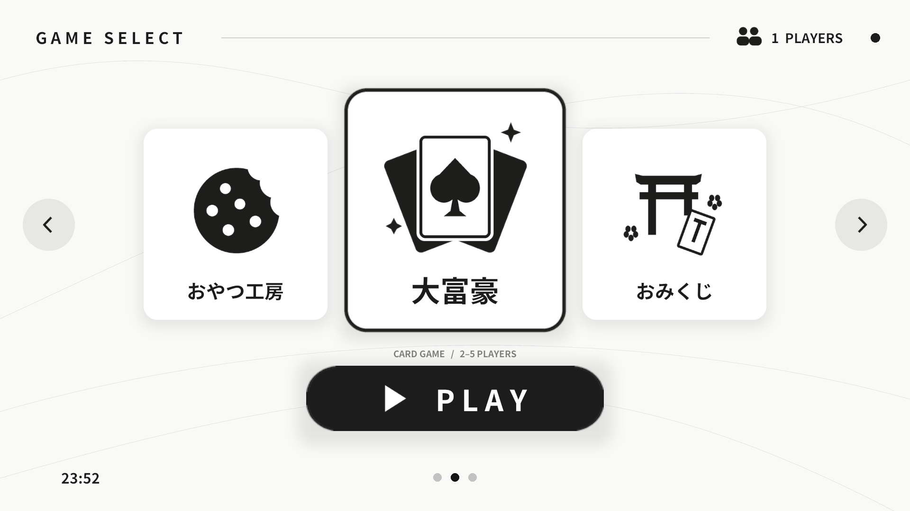
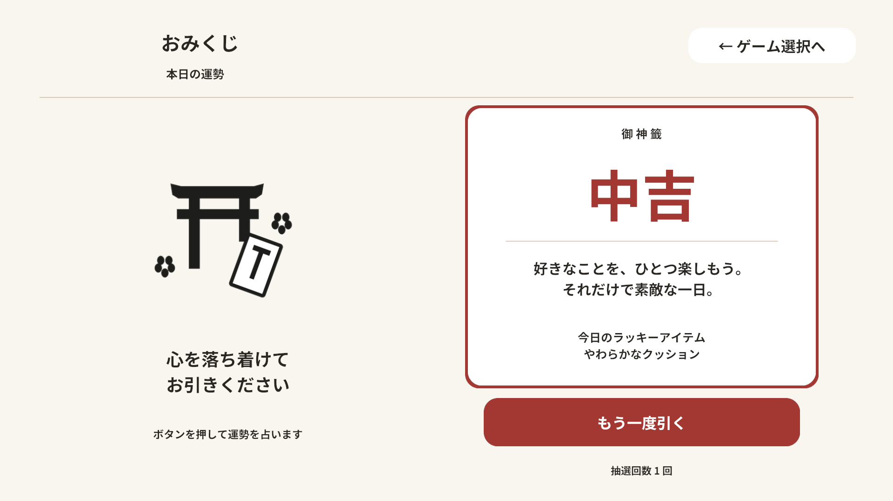
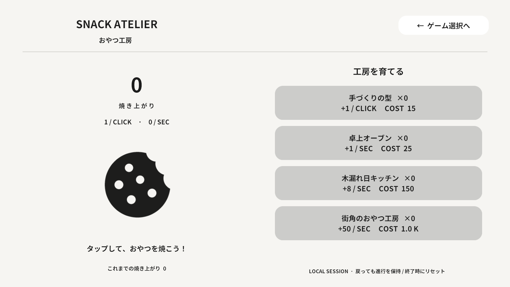
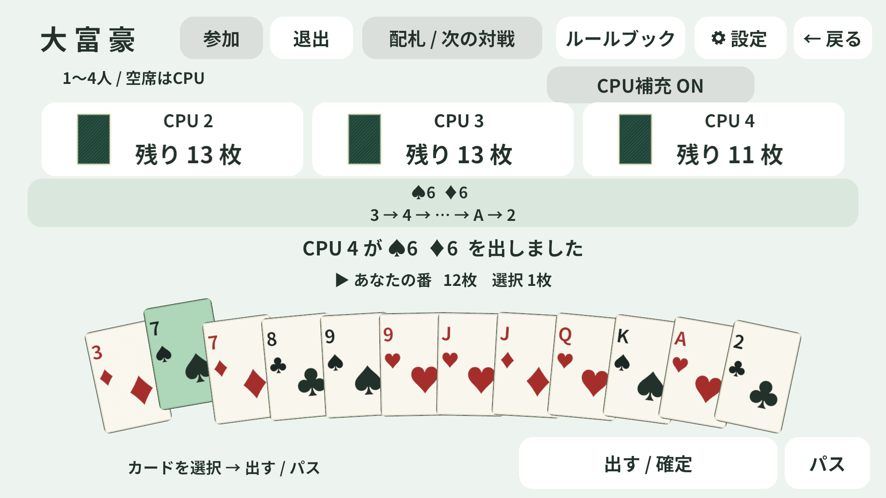
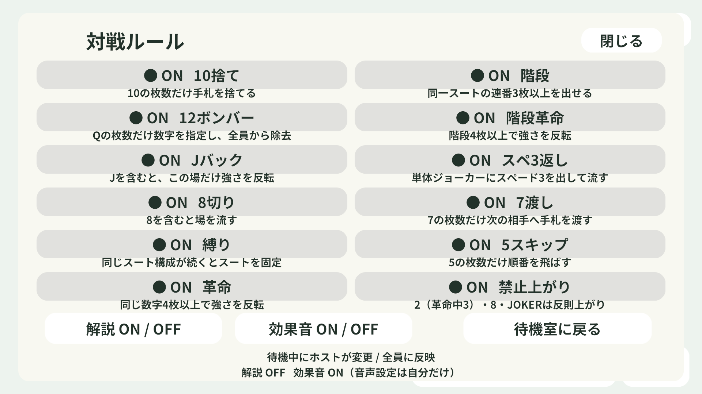
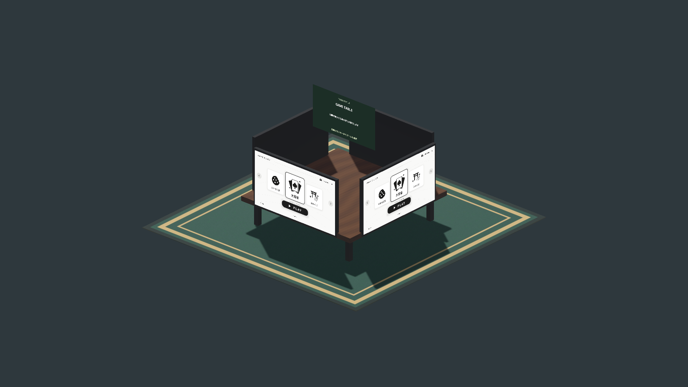

# MenSharp Game Select

VRChat向けの16:9ゲーム選択パネルと、MenSharp製の大富豪・おやつ工房・おみくじ。ゲーム名フォルダーの追加・削除でゲームを管理できます。



## v0.5.0：読みやすいUI・扇状の手札・テーブルルーム

大富豪を実装しました。人間1～4人が参加でき、空席をCPUで埋めて4席で対戦します。CPU補充OFFも選べます。歯車から12ルールを切り替え（初期すべてON）、ゲーム内のルールブックで説明を確認できます。解説ONで効果を読み上げます。音声：**VOICEVOX:ずんだもん**。音声の利用条件は[同梱の案内](Assets/GameSelect/Packages/Daifugo/Audio/Voice/LICENSE.txt)を参照してください。

## ゲーム選択画面

おみくじを実装し、既存の生産ゲームを独自名称「おやつ工房」に変更しました。ゲーム選択画面の左下には各プレイヤーの端末時刻（HH:mm）を表示します。

## 4モニター・共有起動

テーブル中央にプレイヤーを向く表示専用モニターを追加しました。大富豪の場・縛り・Jバック・革命・手番や、おやつ工房のみんなの累計スコアを表示します。ゲームごとに表示を拡張できます。詳しくは[共有モニターの仕様](Assets/GameSelect/SHARED_DISPLAY.md)を参照してください。

GameRoom.prefabに4枚のモニターを配置しました。どのモニターからゲームを開いても全モニターで起動し、戻る操作も共通です。ゲームIDをManual同期し、途中参加時は受信状態から復元します。大富豪では参加・手札所有・手番・効果・順位も同期します。詳細は[ROOM.md](Assets/GameSelect/ROOM.md)。

## 機能

- 左右に循環するカルーセル、ホバーフォーカス、PLAY。
- おやつ工房：クリック生産、クリック強化、自動生産設備、効果音、選択画面へ戻る。
- ゲームフォルダーにJSON・本体ソース・生成処理・画像・音声を同梱。
- フォルダーを削除すると一覧と生成ゲームを除去。復元時は再登録。
- 大富豪：参加、配札、手札操作、パス、順位、次の対戦での交換、CPU、12ルール、解説音声。
- おみくじ：抽選・結果表示・効果音。

## 導入

確認環境：Unity 2022.3.22f1 / VRChat SDK Worlds 3.10.5 / MenSharp 0.1.1。

1. VRChat Creator CompanionでWorldsプロジェクトを作成します。
2. [MenSharp](https://github.com/ProjectTesca/MenSharp)を導入します。VRChat SDK・MenSharp本体はこの配布物に含みません。
3. [Releases](https://github.com/SakiikaVR/mensharp-game-select/releases)から `.unitypackage` をインポートします。ソースから使う場合はこのリポジトリのAssetsをプロジェクトのAssetsにコピーします。
4. コンパイル完了後、`MenSharp > Compile All` を実行します。
5. 4枚構成は `Assets/GameSelect/GameRoom.prefab` を配置します。既存の単体パネルを拡張する場合は `Game Select > Create Four Monitor Room`。1枚だけならGameSelectPanel.prefabも使えます。
6. `Game Select > Refresh JSON Catalog` を実行し、シーンを保存します。

ClientSimではメニューの **Close Menu** を押し、**Tabを押しながらクリック** します。パネルはInteractiveレイヤー (8) を使用します。UIレイヤー (5) にすると、VRChatメニューを閉じた際にクリック対象から外れます。

## ゲームの追加・削除

```text
Assets/GameSelect/Packages/SnackAtelier/
├─ game.json
├─ Runtime/CookieClickerGame.cs
├─ Runtime/CookieClicker.Runtime.asmdef
├─ Runtime/Programs/
├─ Editor/ClickerPackageBuilder.cs
├─ Images/
└─ Audio/
```

`.meta`を含むフォルダー全体を `Assets/GameSelect/Packages/` に入れると追加、削除またはAssets外へ移すと解除されます。詳細は [パッケージ仕様](Assets/GameSelect/PACKAGES.md)。既存の`.json`登録と`.gamepackage`も読めますが、ゲーム全体の配布にはフォルダー形式を使います。

変更はUnity編集時に反映します。公開済みVRChatワールドへの反映には再ビルド・アップロードが必要です。4枚構成ではゲームの起動・終了を同期します。大富豪は内部状態も同期します。ゲームの永続保存はありません。クリッカーの進行は同じセッション中のみ保持します。

## ライセンス

- 自作コード・図形画像・合成効果音：**MIT**。 [LICENSE](LICENSE)
- MenSharp：**MIT**, Copyright (c) 2026 Tesca。 [全文](ThirdPartyLicenses/MenSharp-MIT.txt)
- 同梱Noto Sans JP Bold：**SIL OFL 1.1**。フォントにはMITを適用しません。 [全文](ThirdPartyLicenses/NotoSansJP-OFL.txt)

出典・配布対象は [THIRD_PARTY_NOTICES.md](THIRD_PARTY_NOTICES.md) を参照してください。VRChat SDK、MenSharpコンパイラ、Windowsフォント、個人のUnity設定やログは同梱していません。

## 検証

ClientSimで左右の実クリック、クッキーの実クリック、購入・所持数不足・価格上昇・自動生産・再開時の進行保持を確認。ゲームフォルダーをAssets外へ移して本体アセンブリがない状態での登録解除と、復元後の再登録も確認しています。VRChat実クライアントでの公開ワールド検証は別途必要です。






v0.3.0追加検証：ClientSimで4枚の時計更新、変更後のパッケージIDによる共有起動・終了、生産・購入・価格上昇、抽選100回で中吉・大吉のみ、抽選中の連打防止と再開、通常の抽選演出を確認。Unityコンソールエラー0件。

旧版から更新する場合は、古い `Assets/GameSelect/Packages/CookieClicker` をフォルダー全体で取り除いてからインポートしてください。新しい `SnackAtelier` と同時に置くとクラス定義が重複します。`.meta`も含めて扱ってください。





大富豪の検証：20回の基本対戦、30回のCPU対戦（2～4席）、ルール境界と交換を自動検証。ClientSimのUdon上でも対戦終了まで実行し、ボタンからの提出・11設定・解説と手番音・4表示・受信再描画を確認しました。実VRChatの複数クライアント間対戦は未検証です。

UIの文字とボタンを拡大し、扇状のカードと相手の残り枚数表示を追加しました。禁止上がり（通常2・革命中3・8・JOKER）は初期ONです。木目の四角い机と縁取り付きカーペット、外向きモニターを同梱します。


